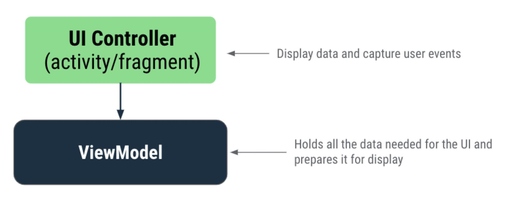
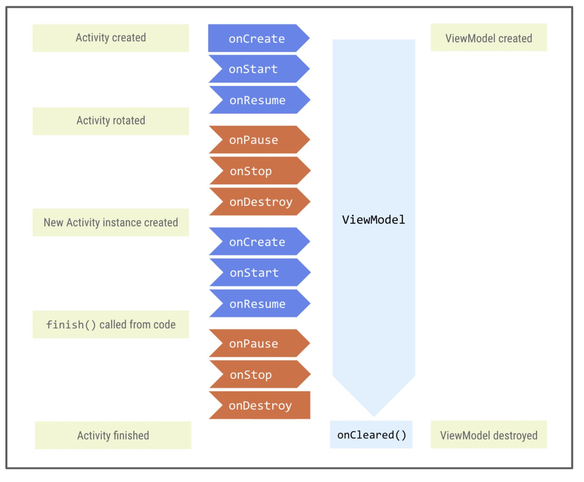

# Architecture components

## Store data in ViewModel

[Android Architecture Components](https://developer.android.com/topic/libraries/architecture?authuser=1)
are part of 
[Android Jeptack](https://developer.android.com/jetpack?authuser=1)
libraries to help us design apps with good 
architecture. Architecture components provide guidance on app
architecture, and it is the recommended best practice.

Here we use [`ViewModel`](https://developer.android.com/topic/libraries/architecture/viewmodel?authuser=1)
which is used to store app data. The stored data is not lost if
the framework destroys and re-creates the activities and fragments
during a configuration change or other events.

Architecture provides you with the guidance to help you allocate
responsibilities in the app between classes. A well designed
app architecture helps you to scale your app and extend it with 
additional features in the future. It also makes team collaboration
easier.

The common common architectural principles are:

- <b>Seperation of concerns</b>: States that the app should be divided 
into classes, each with seperate responsibilities
- <b>Driving UI from a model</b> (perferably a persistent model). 
Models are components that are responsible for handling the data for an 
app. They are independent from `Views` and app components in the app so 
they are unaffected by the app's lifecycle and associated concerns.

The main classes or components in Android Architecture are UI 
Controller (activity/fragment), `ViewModel`, `LiveData` and `Room`.
These components take care of some of the complexity of the 
lifecycle and help you avoid lifecycle related issues. 

The basic architecture looks like:



<h3>UI controller (Activity/Fragment)</h3>

Activities and fragments are UI controllers. These control the UI by
drawing views on the screen, capturing user events and anything
else related to the UI that the user interacts with. Data in the app
or any decision-making logic about that data should not be in the UI
controller classes.

The Android System can destroy UI controllers at any time based on 
certain user interactions or because of system conditions like low
memory. Because these events aren't under our control, no data should
be stored in UU controllers. Instead, the decision-making logic about
the data should be added in your `ViewModel`

e.g. in the <b>Unscramble app</b>, the scrambled word, score and word
count are displayed in a frgment. The decision making code, such as
figuring out the next scrambled word, and calculations of score and
word count should be in the `ViewModel`.

<h3>`ViewModel`</h3>

The `ViewModel` is a model of the app data that is displayed in the 
views. Models are components that are responsible for handling the 
data for an app. They allow your app to follow the architecture 
principle, driving the UI from the model.

The `ViewModel` stores the app related data that isn't destoryed when 
activity or fragment is destoryed and recreated by the Android
framework. `ViewModel` objects are automatically retained during
configuration changes so that data they hold is immediately
available to the next activity or fragment instance.

To implement `ViewModel` in the app, extend the `ViewModel` class, 
which is from the architecture comonents library, and store app data
within that class.

### Store data in the view model

In this case the app will have a `MainActivity` that contains a 
`GameFragment`, and the `GameFragment` will access information
about the game from the `GameViewModel`.

To associate a `ViewModel` to a UI controller (activity/fragment),
create a reference (object) to the `ViewModel` inside the UI 
controller.

This is done using:

``` Kotlin
private val viewModel: GameViewModel by viewModels()
```

This uses the delegate property definition, i.e. using the `by` clause
and a delegate class instance:

``` Kotlin
// Syntax for property delegation
var <property-name> : <property-type> by <delegate-class>()
```

If instead the `ViewModel` was initialised as:

```Kotlin
private val viewModel = GameViewModel()
```

Then the app would lose the state of the `viewModel` reference when
the device goes through a configuration change. 

The delate approach delegates the responsibility of the `ViewModel` 
object to a seperate class called `viewModels`. This means that when
the `viewModel` object is accessed, it is handled internally by the
delegate class, `viewModels`. This creates the `viewModel` object
for you on the first access and retains its value through
configuration changes and returns the value when requested.

### Move data to the ViewModel

Seperating the app's UI data from the UI controller (the `Activity`/
`Fragment` classes) let's you better follow the single responsibility
principle. The activities and fragments are responsble for drawing 
views and data to the screen, while the `ViewModel` is responsible
for holding and processing all the data needed for the UI.

This means moving the data variables from `GameFragment` to
`GameViewModel` class.

If we move the data as:

``` Kotlin
class GameViewModel : ViewModel() {

    private var score = 0
    private var currentWordCount = 0
    private var currentScrambledWord = "test"
...
```
This means that the properties are private to the `ViewModel` and 
are not accessible by the UI controller.

We can't make them public, as the data should not be editable by other
classes. The data should be editable only inside the `ViewModel` so they
should be `private` and `var` but they should be readable from 
outside so they should be `public val`. Kotlin resolves this with
a feature called [backing property](https://kotlinlang.org/docs/properties.html#backing-properties).

This results something from a `getter` other than the exact object. 
A backing property will override the getter method to return a 
read-only version of the data e.g.:

``` Kotlin
// Declare private mutable variable that can only be modified
// within the class it is declared.
private var _count = 0 

// Declare another public immutable field and override its getter method. 
// Return the private property's value in the getter method.
// When count is accessed, the get() function is called and
// the value of _count is returned. 
val count: Int
   get() = _count
```

Inside the `ViewModel` class the property `_count` is `private` and 
mutable. The convention is to prefix the `private` property with
an underscore.

Outside the `ViewModel` class the, the default visibility modifier
is `public`, so `count` is public and accessible from other classes
like UI controllers. In this case only `get()` is being overriden so 
the property is immutable and read-only. When an outside class accesses
the property, it returns a value of `_count` and its value can't
be modified. This protects the app data.

### The lifecycle of a ViewModel

The framework keeps the `ViewModel` alive as long as the scope 
of the activity fragment is alove. A `ViewModel` is not destroyed
if its owner id destoryed for a configurtation change such as
screen rotation. The new instance of the owner reconnects to the 
existing `ViewModel` instance, as illusated by:



We can check the lifecycle by adding code:

``` Kotlin
class GameViewModel : ViewModel() {
   init {
       Log.d("GameFragment", "GameViewModel created!")
   }

   ...
}
```

The initializer block (also known as the `init` block) is a place
for initial setup code needed during the initialisation of an 
object instance. They are prefeixed by the `init` keyword 
followed by the curly braces `{}`. The block of code is run when 
the object instance is first created and initialised. 

### Populate view model

Typically when you declare a variable you provide it with an initial
value upfront. But you could also intialise it later. To late initialise
a property in kotlin you use the keyword `lateint`. This is used if you
guarantee that you will initialise the property before using it. Memory
is not allocated to the variable unit until it is initialised. If you
try to access the variable before initialising it, the app will crash.

An `Array` is similar to a `MutableList` but it has a fixed size when 
it's initialised. 

### Dialogs

A dialog is a small window (Screen) that prompts the user to make a 
decision or enter additional information. Normally a dialog does not fill
the entire screen and it requires users to take action before they can
proceed. 

Since a dialog is a UI related component, the `GameFragment` will be 
responsible for creating and showing the final score dialog.

### Summary

- The Android app architecture guidelines recommend seperating classes
 that have different responsibilities and driving the UI from a model
- A UI controller is a UI based class like `Activity` or `Fragment`. UI
controllers should only contain logic that handles UI and operating 
system interactions; they shouldn't be the source of data to be 
displayed in the UI. Put that data and any related logic in a `ViewModel`
- The `ViewModel` class stores and managers UI-related data. The 
`ViewModel` class allows data to survive configuration changes such as 
screen rotations
- `ViewModel` is one of the recommended Android Archictecture Components