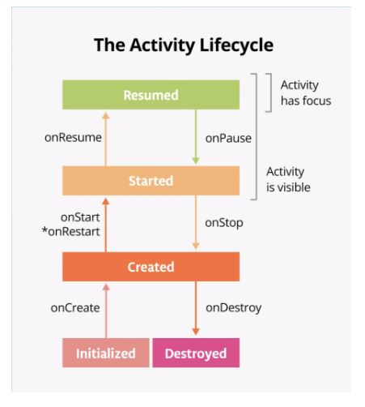
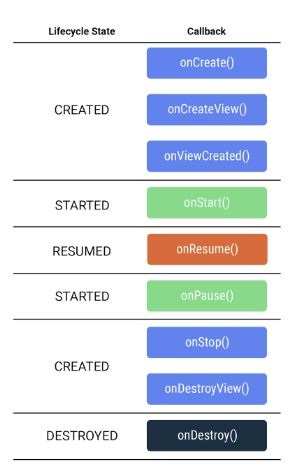

# Navigate between screens

## Collections in Kotlin

A collection is a group of related items. This can be ordered or unordered,
and the items can be unique or not. As with lists Kotling distinguishes 
between mutable and immutable collections.

Another collection is a set. This is a group of items like a list but 
there can't be any duplications and the order doesn't matter. This can
be created like:

``` Kotlin
fun main() {
    val numbers = listOf(0, 3, 8, 4, 0, 5, 5, 8, 9, 2)
    val setOfNumbers = numbers.toSet()
    println("set:    ${setOfNumbers}")
}
```

To make it mutable you use:

``` Kotlin
val set1 = setOf(1,2,3)
val set2 = mutableSetOf(3,2,1)
```

Another type of collection is a `map` or `dictionary`. A map is a set of
key-value pairs, designed to make it easy to look up a value given a 
particular key. Keys are unique and each key maps to exactly one value,
but the values can have duplicates. This can be created as:

``` Kotlin
fun main() {
    val peopleAges = mutableMapOf<String, Int>(
        "Fred" to 30,
        "Ann" to 23
    )
    println(peopleAges)
}
```

To add more entries to the map we can use the `put()` function, passing
in the key and the value:

``` Kotlin
peopleAges.put("Barbara", 42)
```

or short hand notation to add entries:

``` Kotlin
peopleAges["Joe"] = 51
```

### working with collections

If collections are mutable, you can add or remove items. You can enumerate
all the items, find a particular items. or sometimes convert one type of 
collection to another. 

#### Useful functions:

- `forEach()`
    - goes through all the objects in a collection e.g.:
    ``` Kotlin
    peopleAges.forEach { print("${it.key} is ${it.value}, ") }
    ```
    - This uses the identifier `it` for specifying teh current item
    - The code is run inbetwen `{}`
- `map()`
    - Applies a transformation to each item in a collection e.g:
    ``` Kotlin
    println(peopleAges.map { "${it.key} is ${it.value}" }.joinToString(", ") )
    ```
    - Applies to each item and creates a new collection of the transformed
    items
    - The part in the curly braces `{}` defines the transformation to apply
    to each item.
- `filter()`
    - returns the items in a collection that match based on an expression
    - e.g:
    ``` Kotlin
    val filteredNames = peopleAges.filter { it.key.length < 4 }
    println(filteredNames)
    ```

### Lambdas and higher-order functions

A lambda expression is a function with no name that can be used immediately.
You can store functions in variables and classes, pass functions as 
argum,ents and even return functions. They can be treated like variables
of other types such as `Int`.

To enable this type of behaviour, Kotlin has something called <i> function
tyoes </i> where you can define a specific type of function based on its
input parameters and return values. This appears in the format:

``` Kotlin
(Int) -> Int
```

A function of the above type must take in a parameter of type `Int` and 
return a value of type `Int`. In a function type nottaion, the 
parameters are listed in parentheses (seperated by commas if there are
multiple parameters). Then there is an arrow `->` which is followed by the
return type. 

For examplea lambda could be stored which triples an integer:

``` Kotlin
fun main() {
    val triple: (Int) -> Int = { a: Int -> a * 3 }
    println(triple(5))
}
```

Which can also be shortened to:

``` Kotlin
val triple: (Int) -> Int = { it * 3 }
```

Following that, higher-order functions are when you
pass a function (in this case a lambda) to another
function, or returning a function from another 
function.

`map`, `filter` and `forEach` are higher-order
functions because they all took a function as a
parameter. 

For example, you can pass a function to `sortedWith()`
method to sort a list of strings e.g.

``` Kotlin
fun main() {
    val peopleNames = listOf("Fred", "Ann", "Barbara", "Joe")
    println(peopleNames.sorted())
    println(peopleNames.sortedWith { str1: String, str2: String -> str1.length - str2.length })
}
```

Examples in Android include `onClickListener` and `OnKeyListener`

## Activities and Intents

### Intents

An <i>intent</i> is an object representing some action to be performed
. The most common use for an intent is to launch an activity. There
are two types of intents - <b>implicit</b> and <b>explicit</b>. 

- An <b>explicit intent</b> is highly specific, where you know the
exact activity to be launched, often a screen in yur own app.
- An <b>implicit intent</b> is a bit more abstract where you tell the 
system the type of action, such as opening a link, composing an email,
or making a phone call, and the system is responsible for figuring
out how to fulfill the request. 

Generally, when showing an activity in your own app you use an 
explicit intent. But for actions that don't necessarily involve the 
current app, e.g. an extenrla link, you'd use <b>implicit intent</b>.

### Setting up an explicit intent

In the case of the word app, we can create an intent to launch the 
`DetailActivity` which is the second list of words.

For this we need to:
- Set up something that will trigger the new activity
- Get a reference to the context
- Create an intent passing in the context and the class name of the
dest activity to create the new object behind the scenes
- Pass in any extra data
- Start the activity on the context object.

In this case the code looks like:

``` Kotlin
 // create a listener for the button
        holder.button.setOnClickListener{
            // get a reference to the context
            val context = holder.itemView.context
            // create an intent passing in the context and the class name of the dest activity
            // this creates a DetailActivity object behind the scenes
            val intent = Intent(context, DetailActivity::class.java)
            // this passes the extra data, in this case the letter, to the new activity
            intent.putExtra("letter", holder.button.text.toString())
            // then start activity on the context object passing the intent
            context.startActivity(intent)
        }
```

which is implemented in the `onBindViewHolder()` of the `LetterAdapter`
class. 

The information then passed from the `MainActivity` can be retried in the 
`DetailActivity` using:

``` Kotlin
val letterId = intent?.extras?.getString("letter").toString()
```

- The `intent` property is part of any activity and keeps a reference to
the intent that was used to launch the activity
- The `extras` property is of type `Bundle` which provides a way to access 
all extras passed into the intent
- Both are marked with question mark as both properties are nullable. To 
safely access a property or call a function on a `null` object, you put 
a `?` after the name.
- We add `toString()` to ensure `letter` is a `String` and not `null`

Currently, both the code to perform the intent and retrive the selected 
letter hardcard the name of the extra `letter`. While this works for the 
small example, it is not the best approach for large apps where you have
many more intent extras to keep track off. We need a way to define a 
constant that can be used across multiple classes while keeping the code
organised. 

For this there is a Kotlin feature that can be used to seperate constants
and make them usable without a particular instance of the class called 
[companion objects](https://kotlinlang.org/docs/object-declarations.html).
This is similar to other objects, such as instances of a class, but only
a single instance of a companion object will exist for the duration of your
program which is why this is sometimes called the 
[singleton pattern](https://en.wikipedia.org/wiki/Singleton_pattern). In 
this case we will use a companion object to refactor the code for the 
"letter" extra.

For this we create a companion object:

``` Kotlin
    companion object {
        const val LETTER = "letter"
    }
```

call this in `DetailActivity` `onCreate()`:

``` Kotlin
val letterId = intent?.extras?.getString(LETTER).toString()
```

And use this in the `putExtra` of `LetterAdapter`:

``` Kotlin
intent.putExtra(DetailActivity.LETTER, holder.button.text.toString())
```

### Setting up an implicit activity

In this case we are going to use the dictionary functionalkity provided by
Google search to show the definition of each word, using the devices 
browser to show the search page.

For this we can add an `onClickListener` to each word as:

``` Kotlin 
        holder.button.setOnClickListener {
            // create a URI for the destination
            val queryUrl: Uri = Uri.parse("${DetailActivity.SEARCH_PREFIX}${item}")
            // create a new intent
            // use ActionView which takes a URI which the system knows to process
            // this using the user's web browser
            val intent = Intent(Intent.ACTION_VIEW, queryUrl)
            // start the activity by passing in the intent
            context.startActivity(intent)
        }
```

### Set up menu and icons

We can now add a menu option so that users can toggle between list and grid 
layout for the letters. 

The top of apps are called app bar. The menu option is set up from the 
`MainActivity` and uses `menu` in the `res` folder. These allow 
you to add buttons and menus to the app bar.

### Summary

- Explicit intents are used to navigate specific activity in the app
- Implicit intents correspond to specific actions and let the system
determine how to fulfill the intent
- Menu options allow you to add buttons and menuts to the app bar
- Companion objects provide a way to associate reusable constants with a
type rather than instance of the type
- To perform an intent:
    - Get a reference to the context
    - Create an `Intent` object providing either an activity or intent type
    (depending on whether explicit or implicit)
    - Pass any needed data by calling `putExtra`
    - Call `startActivity()` passing the `intent` object


Commonly used intents can be found [here](https://developer.android.com/guide/components/intents-common?authuser=1)

## Stages of the activity lifecycle

The activity lifecycler is the set of states an activity can be in during its
lifetime. This extends from when the activity is initially created to when
it is destroyed and the system reclaims that activity's resources. As a user
navigates activities in the app, those activities transition between different
states in the lifecycle.


The Activity lifecyler is as follows:



Where the callback methods are invoked when the activity moves
from one state to another. These can be overwriten to perform tasks in 
response tothose lifecycle changes. 

We can track when changes are happening using logging.

### `onCreate()`

The `onCreate` method must be implemented in every activity. This is where
you should do any one-time initalisatios for the activity. This is where you
inflate the layout, define click listeners or set up the view binding.

This is called once, just after the activity is initialised. When the new 
`Activity` object is created in memory. After `onCreate()` executes then
the activity is created.

When you override the `onCreate()` method you must call the superclass
implementation to complete the creation of the activity. So within it
you must immediately call `super.onCreate()`. The same is true for other
lifecycle callback method. 

For logging there are three parts of the command:

- The priority of the message e.g. `Log.d()` method writes debug messages
- The log tag (first parameter). This is a string that lets you more easily
find the log message in the Logcat. This is typically the name of the class.
    - A good convention is to declare a TAG constant in the class e.g.
    `const val TAG = MainActivity`
- The actual log message (second parameter), is  short string.

### `onStart()`

The `onStart()` lifecycle method is called just after `onCreate()`. After
`onStart()` runs then the activity is visible on the screen. `onStart()` 
may be called many times in the lifecycle of the activity.

This is paired with a corresponding `onStop()` lifecycle method. If the 
user starts the app and then returns to the device's home screen, the activity
is stopped and is no longer visible on screen. 

### `onResume()`

`onResume()` is also called when the app is start even if there is nothing
to resume. This gives the activity focus and makes it ready for the user 
to interact with it. 

This is called when the activity has focus (i.e. after a call or share)

### `onRestart()`

This is called before the activity is visible but when the app is restarted.
The `onResart` is a place to put code that you only want to call if your
activity is not being started for the first time.

### `onPause()`

This is called when the activity loses focuses i.e. a call comes in. This
only lasts a short time before returning to the activity or navigating to
another activity or app. You generally want to keep updating the UI so
the rest of the app doesn't appear to freeze.

### `onSaveInstanceState()` 

This method is a callback you use to save any data that you might need if
the `Activity` is destroyed. In the lifecycle callback diagram,
`onSaveInstanceState()` is called after the activity has been stopped (`onStop`).
It is called every time the app goes into the background.

This gives you a chance to save a small amount of information to a bundle
as the acitivity exits the foreground. The system saves this data now
because if it waited until it was shutting down the app, the system
might be under resource pressure. 

Saving the data each time ensures that updated data in the bundle is available
to restore. 

This is called after `onStop()` e.g.:

``` Kotlin
    // called after `onStop()`
    override fun onSaveInstanceState(outState: Bundle) {
        super.onSaveInstanceState(outState)
        // put int puts integers and takes two arguments
        // the key string
        // the integer value
        outState.putInt(KEY_REVENUE, revenue)
        outState.putInt(KEY_DESSERT_SOLD, dessertsSold)

        Log.d(TAG, "onSaveInstanceState Called")
    }

```

Where the constants have been declared before the class decleration:

``` Kotlin
const val TAG = "MainActivity"
const val KEY_REVENUE = "revenue_key"
const val KEY_DESSERT_SOLD = "dessert_sold_key"
```

saves the state of the revenue and deserts sold. This is then passed
back to the `onCreate()` method:

``` Kotlin
if (savedInstanceState != null) {
    // get the data from the item
    revenue = savedInstanceState.getInt(KEY_REVENUE, 0)
    dessertsSold = savedInstanceState.getInt(KEY_DESSERT_SOLD, 0)
}
```

## Intro to navigation

Many andoird apps don't need a seperate activity for ever screen. Many common
UI patterns, such as tabs, exist within a single activity using <i>fragments
</i>. 

A [fragment](https://developer.android.com/guide/fragments?authuser=1) is a 
reusable piece of UI. They can be reused and embedded in one or more 
activities i.e. switching tabs. 

Multiple fragments can even be shown at once on a isngle screen, such
as a master-detail layout for tablet devices

### Fragments and the fragment lifecycle

A fragment is a reusable pice of the app's user interface. Like activities,
fragments have a lifecycle and can respond to user input. A fargment is 
always contained within the view hierarchy of an activity when it is shown 
onscreen. Due their emphasis on reusability and modularity, it's even possible 
for multiple fragments to be hosted simultaneously by a single activity.
Each fragment managers its own seperate lifecycle.

The fragment lifecycke gas five stats, represented by the 
[`Lifecycle.State](https://developer.android.com/reference/kotlin/androidx/lifecycle/Lifecycle.State?authuser=1)
enum:

- INITIALIZED: A new instance of the fragment has been instantiated
- CREATED: The first fragment lifecycle methods are called. During this 
state, the view associated with the fragment is also created.
- STARTED: The fragment is visible onscreen but does not have "focus",
meaning it can't respond to user input.
- RESUMED: The fragment is visibel and has focus
- DESTROYED: The fragment object has been de-instantiated

The `Fragment` class provides many methods that can be overrided to
lifecycle events:

- `onCreate()`: The fragment has been instantiated and is in the CREATED state. 
However, its corresponding view has not been created yet.
- `onCreateView()`: This method is where you inflate the layout. 
The fragment has entered the CREATED state.
- `onViewCreated()`: This is called after the view is created. In this method, 
you would typically bind specific views to properties by calling findViewById().
- `onStart()`: The fragment has entered the STARTED state.
- `onResume()`: The fragment has entered the RESUMED state and now has focus 
(can respond to user input).
- `onPause()`: The fragment has re-entered the STARTED state. The UI is 
visible to the user
- `onStop()`: The fragment has re-entered the CREATED state. The object 
is instantiated but is no longer presented on screen.
- `onDestroyView()`: Called right before the fragment enters the DESTROYED state. 
The view has already been removed from memory, but the fragment object still exists.
- `onDestroy()`: The fragment enters the DESTROYED state.

</br>

Represented as:



</br>
The main differences is with the `onCreate()` methods. With activities this would
be used to inflate the layout and bind views. In the fragment lifecycle `onCreate()`
is called before the view is created so you can't inflate the layout here. Instead
this is done in `onCreateView()`. Then, after the view has been created, the 
`onViewCreated()` method is called when you can bind properties to specific views.

### Create fragment and layout files

As with activities, each fragment consists of two files:

- An XML file for the layout
- A Kotlin class to display data and handle user interactions

### Implement LetterListFragment

As with activities, we need to ifnlate the layout and bind individual views.

### Jetpack navigation

Android Jetpack provides the navigation component to help you handle any navigation 
implementation. This has three key parts:

- Navigation graph: XML file that provides visual representation of navigration
in the app. The file consists of destinations which correspond to individual
activities and fragments as well as actions between them which can be used in 
code to navigate from one destination to another. 
- `NavHost`: use to display destinations from a navigation graph within an
activity. When you navigation between fragments, the destination shown in the
`NavHost` is updated. 
- `NavController`: Object lets you control the navigation between detsinations
displayed in the `NavHost`. The `navigate()` method is used to swap 
fragments that are displayed. This also helps to handle commone tasks like 
responding to the systems "up" button to navigate back to the previously
displayed fragment

We use the `safe Arg` plugin to assist with type safety when passing data
between fragments (like the `putExtra` method with intents. )

### Using the navigation graph

The navigation component refers to the collection of tools for implementing 
navigation, particulalry between fragments. 

NavGraph is a virtual mapping of the app's navigation. Each screen, or fragment,
becomes a possible "destination" that can be navigated to. A `NavGraph` can be
represented by an XML file showing how each destination relates to one another. 

In this case we repurpose `MainActivity.kt` to contain a `FragmentContainerView`
 to act as the NavHost for the fragments. 

### Summary

- Fragments are reusable pieces of UI that can be embedded into activities
- The lifecycler of a fragment differs from the lifecycle of an activity, 
with view setup occuring in `onViewCreated()` rather than `onCreateView()`
- A `FragmentContainerView` is used to embedd fragments in other activities 
and can manage navigate between fragments

Use the navigation component:

- Setting the `navGraph` attribute of a `FragmentContainerView` allows you to 
navigate between fragments within an activity.
- The `NavGraph` editor allows you to add navigation actions and specify arguments 
between different destinations
- While navigating using intents requires you to pass in extras, the Navigation component
uses SafeArgs to auto-generate classes and methods for your navigation actions,
ensuring type safety with arguments

Use cases for fragments

- Using the navigation componet, many apps can manage their entire layout within a
single activity, with all navigation occuring between fragments
- Fragments make common layout patterns possible such as master-detail layouts
on tables, or multiple tabs within the same activity

## Test navigation component

We can create setup scenarios to avoid repeated code using:

``` Kotlin
   lateinit var navController: TestNavHostController

    lateinit var exampleFragmentScenario: FragmentScenario<ExampleFragment>

    @Before
    fun setup(){
        navController = TestNavHostController(
            ApplicationProvider.getApplicationContext()
        )

        exampleFragmentScenario =  launchFragmentInContainer(themeResId=R.style.Theme_Example)

        exampleFragmentScenario.onFragment { fragment ->

            navController.setGraph(R.navigation.example_nav_graph)

            Navigation.setViewNavController(fragment.requireView(),  navController)
        }
    }
```

- `@before` is before each function
- `@beforeClass` is at the beggining of the class
- `@After` runs after each function
- `@AfterClass` is at the end of the class

## Navigation

- `NavHostFragment` - container for fragment destinations
- `NavHostController` - conducts the navigation
- `NavigationView` - Menu for DrawerLayer, not part of the `NavHostFragment` as exists before navigation. This is the menu
that is in the navigation drawer.
- `NavigationUI` - responsible for updating content that is
outside `NavHostFragment` e.g. `BottomNavBar`

## Summary

- `onCreateView()` can be called multiple times in a fragments
lifecycle
- Benefits of fragments:
    - Navigation between fragments allows for more sophisticated
    user interface patterns, such as tab bars
    - Using multiple fragments within an activity allows for an
    adaptive layout across multiple screen sizes
    - The same fragment can be reused across multiple activities
- `onViewCreated()`
    - You should bind view objects to properties in the fragment
    - Set properties of individaul views, such as the recycler
    view's adapter
- `onCreateView()` 
    - You should inflate the layout
- `onSupportNavigateUp` method needs to be override in the host
activity to ensure the app's fragment-based navigation responds
to the app's "Up" button