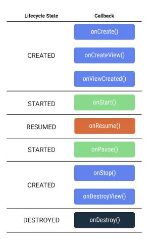

# Intro to navigation

Many andoird apps don't need a seperate activity for ever screen. Many common
UI patterns, such as tabs, exist within a single activity using <i>fragments
</i>. 

A [fragment](https://developer.android.com/guide/fragments?authuser=1) is a 
reusable piece of UI. They can be reused and embedded in one or more 
activities i.e. switching tabs. 

Multiple fragments can even be shown at once on a isngle screen, such
as a master-detail layout for tablet devices

### Fragments and the fragment lifecycle

A fragment is a reusable pice of the app's user interface. Like activities,
fragments have a lifecycle and can respond to user input. A fargment is 
always contained within the view hierarchy of an activity when it is shown 
onscreen. Due their emphasis on reusability and modularity, it's even possible 
for multiple fragments to be hosted simultaneously by a single activity.
Each fragment managers its own seperate lifecycle.

The fragment lifecycke gas five stats, represented by the 
[`Lifecycle.State](https://developer.android.com/reference/kotlin/androidx/lifecycle/Lifecycle.State?authuser=1)
enum:

- INITIALIZED: A new instance of the fragment has been instantiated
- CREATED: The first fragment lifecycle methods are called. During this 
state, the view associated with the fragment is also created.
- STARTED: The fragment is visible onscreen but does not have "focus",
meaning it can't respond to user input.
- RESUMED: The fragment is visibel and has focus
- DESTROYED: The fragment object has been de-instantiated

The `Fragment` class provides many methods that can be overrided to
lifecycle events:

- `onCreate()`: The fragment has been instantiated and is in the CREATED state. 
However, its corresponding view has not been created yet.
- `onCreateView()`: This method is where you inflate the layout. 
The fragment has entered the CREATED state.
- `onViewCreated()`: This is called after the view is created. In this method, 
you would typically bind specific views to properties by calling findViewById().
- `onStart()`: The fragment has entered the STARTED state.
- `onResume()`: The fragment has entered the RESUMED state and now has focus 
(can respond to user input).
- `onPause()`: The fragment has re-entered the STARTED state. The UI is 
visible to the user
- `onStop()`: The fragment has re-entered the CREATED state. The object 
is instantiated but is no longer presented on screen.
- `onDestroyView()`: Called right before the fragment enters the DESTROYED state. 
The view has already been removed from memory, but the fragment object still exists.
- `onDestroy()`: The fragment enters the DESTROYED state.

</br>

Represented as:



</br>
The main differences is with the `onCreate()` methods. With activities this would
be used to inflate the layout and bind views. In the fragment lifecycle `onCreate()`
is called before the view is created so you can't inflate the layout here. Instead
this is done in `onCreateView()`. Then, after the view has been created, the 
`onViewCreated()` method is called when you can bind properties to specific views.

### Create fragment and layout files

As with activities, each fragment consists of two files:

- An XML file for the layout
- A Kotlin class to display data and handle user interactions

### Implement LetterListFragment

As with activities, we need to ifnlate the layout and bind individual views.

### Jetpack navigation

Android Jetpack provides the navigation component to help you handle any navigation 
implementation. This has three key parts:

- Navigation graph: XML file that provides visual representation of navigration
in the app. The file consists of destinations which correspond to individual
activities and fragments as well as actions between them which can be used in 
code to navigate from one destination to another. 
- `NavHost`: use to display destinations from a navigation graph within an
activity. When you navigation between fragments, the destination shown in the
`NavHost` is updated. 
- `NavController`: Object lets you control the navigation between detsinations
displayed in the `NavHost`. The `navigate()` method is used to swap 
fragments that are displayed. This also helps to handle commone tasks like 
responding to the systems "up" button to navigate back to the previously
displayed fragment

We use the `safe Arg` plugin to assist with type safety when passing data
between fragments (like the `putExtra` method with intents. )

### Using the navigation graph

The navigation component refers to the collection of tools for implementing 
navigation, particulalry between fragments. 

NavGraph is a virtual mapping of the app's navigation. Each screen, or fragment,
becomes a possible "destination" that can be navigated to. A `NavGraph` can be
represented by an XML file showing how each destination relates to one another. 

In this case we repurpose `MainActivity.kt` to contain a `FragmentContainerView`
 to act as the NavHost for the fragments. 

### Summary

- Fragments are reusable pieces of UI that can be embedded into activities
- The lifecycler of a fragment differs from the lifecycle of an activity, 
with view setup occuring in `onViewCreated()` rather than `onCreateView()`
- A `FragmentContainerView` is used to embedd fragments in other activities 
and can manage navigate between fragments

Use the navigation component:

- Setting the `navGraph` attribute of a `FragmentContainerView` allows you to 
navigate between fragments within an activity.
- The `NavGraph` editor allows you to add navigation actions and specify arguments 
between different destinations
- While navigating using intents requires you to pass in extras, the Navigation component
uses SafeArgs to auto-generate classes and methods for your navigation actions,
ensuring type safety with arguments

Use cases for fragments

- Using the navigation componet, many apps can manage their entire layout within a
single activity, with all navigation occuring between fragments
- Fragments make common layout patterns possible such as master-detail layouts
on tables, or multiple tabs within the same activity

## Test navigation component

We can create setup scenarios to avoid repeated code using:

``` Kotlin
   lateinit var navController: TestNavHostController

    lateinit var exampleFragmentScenario: FragmentScenario<ExampleFragment>

    @Before
    fun setup(){
        navController = TestNavHostController(
            ApplicationProvider.getApplicationContext()
        )

        exampleFragmentScenario =  launchFragmentInContainer(themeResId=R.style.Theme_Example)

        exampleFragmentScenario.onFragment { fragment ->

            navController.setGraph(R.navigation.example_nav_graph)

            Navigation.setViewNavController(fragment.requireView(),  navController)
        }
    }
```

- `@before` is before each function
- `@beforeClass` is at the beggining of the class
- `@After` runs after each function
- `@AfterClass` is at the end of the class

## Navigation

- `NavHostFragment` - container for fragment destinations
- `NavHostController` - conducts the navigation
- `NavigationView` - Menu for DrawerLayer, not part of the `NavHostFragment` as exists before navigation. This is the menu
that is in the navigation drawer.
- `NavigationUI` - responsible for updating content that is
outside `NavHostFragment` e.g. `BottomNavBar`

## Summary

- `onCreateView()` can be called multiple times in a fragments
lifecycle
- Benefits of fragments:
    - Navigation between fragments allows for more sophisticated
    user interface patterns, such as tab bars
    - Using multiple fragments within an activity allows for an
    adaptive layout across multiple screen sizes
    - The same fragment can be reused across multiple activities
- `onViewCreated()`
    - You should bind view objects to properties in the fragment
    - Set properties of individaul views, such as the recycler
    view's adapter
- `onCreateView()` 
    - You should inflate the layout
- `onSupportNavigateUp` method needs to be override in the host
activity to ensure the app's fragment-based navigation responds
to the app's "Up" button